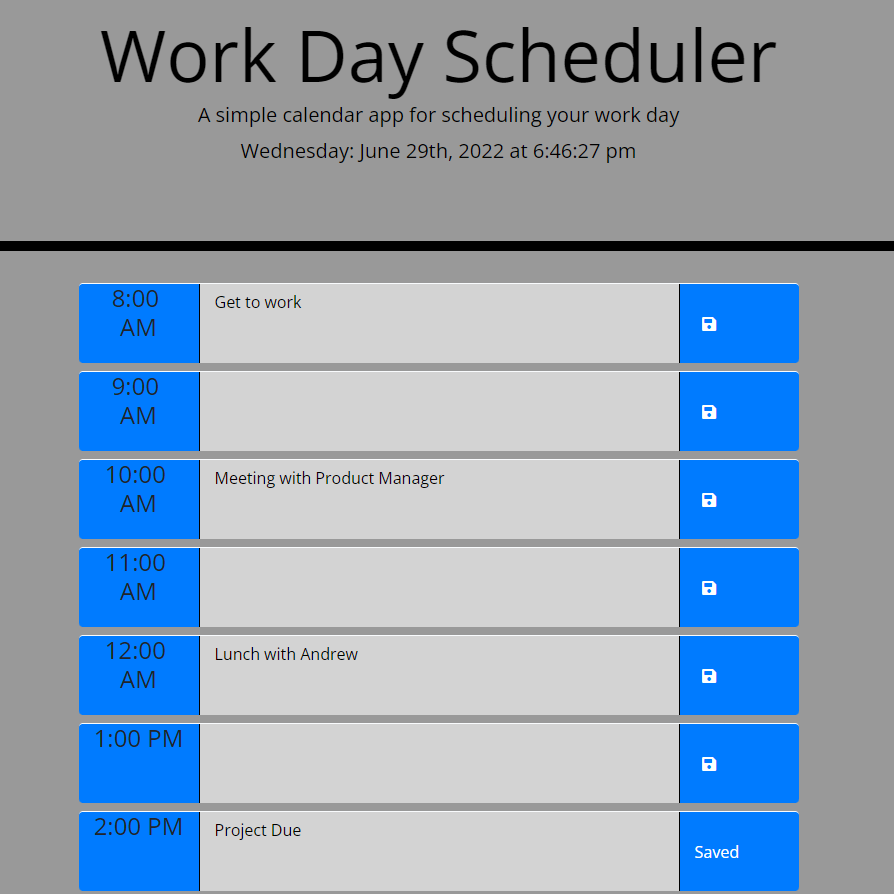

# Challenge-05-Word Day Planner

Challenge 5 for Georgia Tech Coding bootcamp. A day planner that has separate sections for the various hours of the day. Notes can be taken as reminders for things that need to be done for each hour, and then saved to Local Storage. The notes will still be present in each hour when the page is refreshed. The hours also dynamically change color depending on whether the hour is past, present, or future.

## Purpose

This day planner can be used to help a user organize the activities that he/she must complete at given hours in the day. It can greatly facilitate keeping a list of responsibilities and activities organized, as they can differentiate between the different hours of the day. It also provides a dynamic clock at the top of the screen.

## Instructions

Click the middle section of the hour that you would wish to make a note on. Clicking on the field will allow you to enter in a note. You can then click the save icon to the right to save your note to Local Storage. When you click save, you will receive a notification indicating it has successfully saved. You can continue to edit the notes and make additional saves, and each will persist to Local Storage. When you refresh the page, your notes will still be present.

## Legend of Timeslot Colors

Grey: Past Hour
Red: Current Hour
Green: Future Hour

## Deployed Site

```bash
https://huntersteffner.github.io/Work-Day-Scheduler/

```

## Screenshot



## Contributing

This project can be cloned and referenced as inspiration in creating another portfolio webpage. Please only use as a reference.
